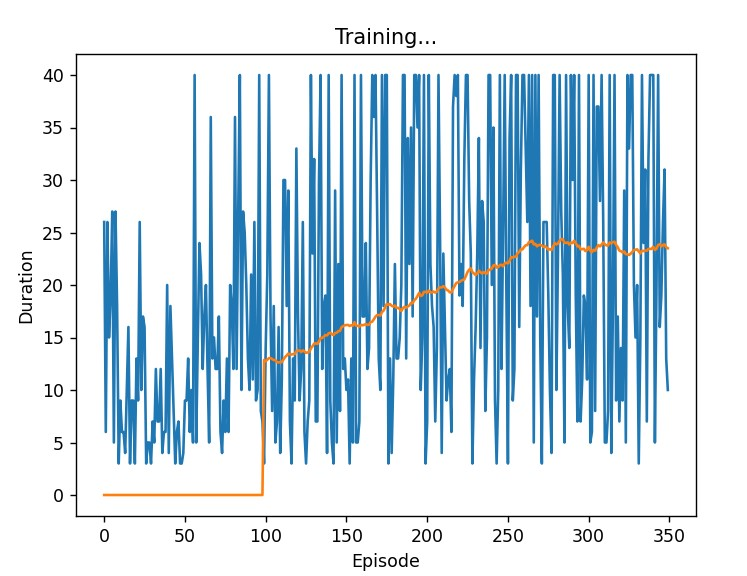
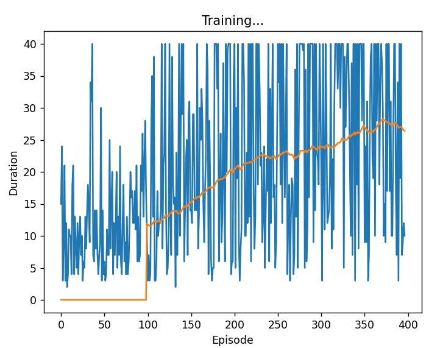

## Highway-v0 env RL agent
This RL project aimed to implement an RL agent with pytorch in the highway-v0 environement. Two methods were considered in this project:
 - **DQN with Replay memory**
 This method stores the transitions that the agent observes allowing us to reuse this data later. By sampling from it randomly. (file: dqn_memory_reply.py)
 - **DQN with Prioritized experience replay**
 This method implements a simple memory buffer replay with priorities on experiences. (file: per.py)

### **Training**
 We trained the two models for 400 episodes, we chose a batch size of 32, and a discount factor of 0.8. The other hyperparametrs as well as the structure of the networks are defined in the files in the src folder.

 We stored our models in the folder `models`.

### **Results**
The average score on 50 episodes with "`DQN with Replay memory`" model is : 26,08. This is the plot duration of episodes in the training.

The average score on 50 episodes with "`DQN with Prioritized experience replay`" model is : 29,37. This is the plot duration of episodes in the training.

### **Demo**

     
    <em>An episode of highway-v0.</em>

